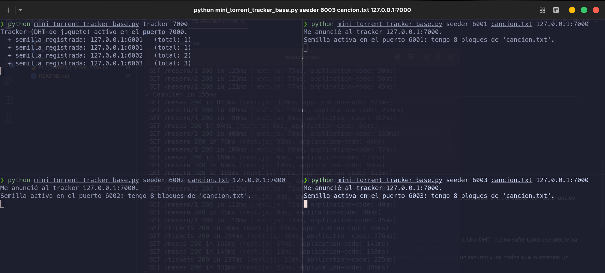

# Actividad: Mini-Torrent P2P con TRACKER (descubrimiento de peers)

**Asignatura:** Arquitectura y Servicios
**Nivel:** segunda parte del mini-torrent

## El problema que resolvemos aquí

> _"El reto técnico es localizar quién tiene cada recurso sin un índice central."_
> — resumen Grupo 1

Aquí añadimos un **TRACKER**: un directorio donde las semillas se **anuncian** y
al que el descargador **pregunta** quién tiene el archivo. Es una **DHT de juguete**:

- En **BitTorrent** ese papel lo hace el _tracker_ o la _Mainline DHT_ (Kademlia).
- En **IPFS** son los _provider records_ (`CID → peer`) sobre Kademlia.

(Nuestro tracker es un solo nodo central para que se entienda la idea; una DHT
real reparte ese directorio entre todos los nodos, sin punto central.)

## Cómo funciona

- `tracker`: guarda una lista de semillas. Entiende `ANNOUNCE` (registrarse) y `PEERS` (dar la lista).
- `seeder`: al arrancar se **anuncia** al tracker y luego sirve los bloques.
- `descargar`: le pide la lista al tracker y descarga de esas semillas (verificando hashes).

## Qué hacer

Completa los **4 TODO** en `mini_torrent_tracker_base.py`.

## Cómo probarlo (súper fácil)

**Terminal 1 (tracker):**

```
python mini_torrent_tracker_base.py tracker 7000
```

**Terminal 2 (semilla 1):**

```
python mini_torrent_tracker_base.py seeder 6001 cancion.txt 127.0.0.1:7000
```

**Terminal 3 (semilla 2):**

```
python mini_torrent_tracker_base.py seeder 6002 cancion.txt 127.0.0.1:7000
```

**Terminal 4 (descarga — fíjate que SOLO pasas el tracker):**

```
python mini_torrent_tracker_base.py descargar descargado.txt 127.0.0.1:7000
```

El descargador imprime las semillas que le dio el tracker y baja los bloques.

### Entre varias computadoras (misma red WiFi)

La compu del tracker averigua su IP (`ipconfig`, ej. `192.168.1.20`). Las semillas
y el descargador usan esa IP como tracker: `... 192.168.1.20:7000`.

## Qué entregar

- El código completado.
- Captura mostrando: el tracker registrando semillas y el descargador recibiendo la lista.
- Responde:
  1. ¿Qué pasa si el **tracker** se cae? ¿Por qué una **DHT real** (Chord/Kademlia) no tiene ese problema?
  2. ¿En qué se parece nuestro `ANNOUNCE`/`PEERS` a los _provider records_ de IPFS?
  3. ¿Por qué el descargador ya no necesita conocer las direcciones de antemano?

## Captura requerida

Abre **4 terminales** para que la evidencia quede clara:

1. Terminal 1: `python mini_torrent_tracker_base.py tracker 7000`
2. Terminal 2: `python mini_torrent_tracker_base.py seeder 6001 cancion.txt 127.0.0.1:7000`
3. Terminal 3: `python mini_torrent_tracker_base.py seeder 6002 cancion.txt 127.0.0.1:7000`
4. Terminal 4: `python mini_torrent_tracker_base.py descargar descargado.txt 127.0.0.1:7000`

La captura debe mostrar al menos estas dos cosas:

- En el tracker, las líneas de registro de semillas: `+ semilla registrada: ...`
- En el descargador, la línea donde recibe la lista: `El tracker me dio 2 semilla(s): ...`

Si quieres dejarlo más claro en la entrega, toma una sola captura donde se vean las salidas de las 4 terminales o dos capturas: una del tracker con los anuncios y otra del descargador con la lista de peers.

### Evidencia adjunta

Tracker y semillas registradas:



Descargador recibiendo la lista de peers y reconstruyendo el archivo:


### Respuestas

1. Si el tracker se cae, nadie puede consultar quién tiene el archivo porque todo el directorio está en un solo nodo. Una DHT real no sufre tanto ese problema porque distribuye y replica la información entre muchos nodos, así que no existe un único punto de fallo.
2. Nuestro `ANNOUNCE`/`PEERS` se parece a los _provider records_ de IPFS porque ambos guardan la relación entre un recurso y los nodos que lo ofrecen: un nodo anuncia que tiene el contenido y otro consulta quién lo posee.
3. El descargador ya no necesita conocer las direcciones de antemano porque primero pregunta al tracker y recibe una lista actualizada de semillas disponibles. Con eso puede descubrir dinámicamente de dónde bajar cada bloque.

## Evaluación

| Criterio                                            | Puntos |
| --------------------------------------------------- | :----: |
| Completa los 4 TODO y todo funciona                 |   50   |
| El descargador descubre las semillas vía el tracker |   20   |
| Captura del tracker + descarga                      |   15   |
| Respuestas que conectan con DHT/IPFS de la teoría   |   15   |

## Reto extra (opcional)

El tracker es un **punto único de fallo** (si se cae, nadie encuentra nada). Investiga
cómo Kademlia reparte ese directorio entre todos los nodos para que no exista ese punto.
